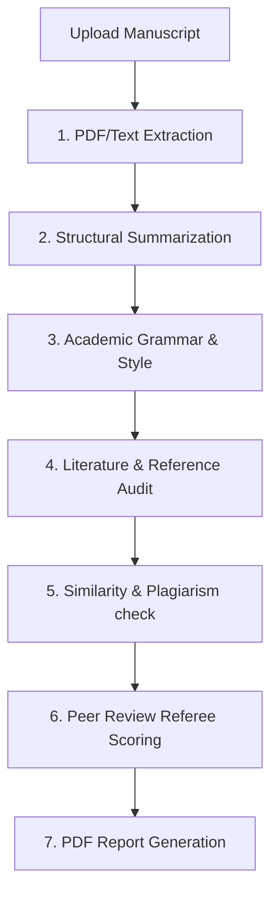
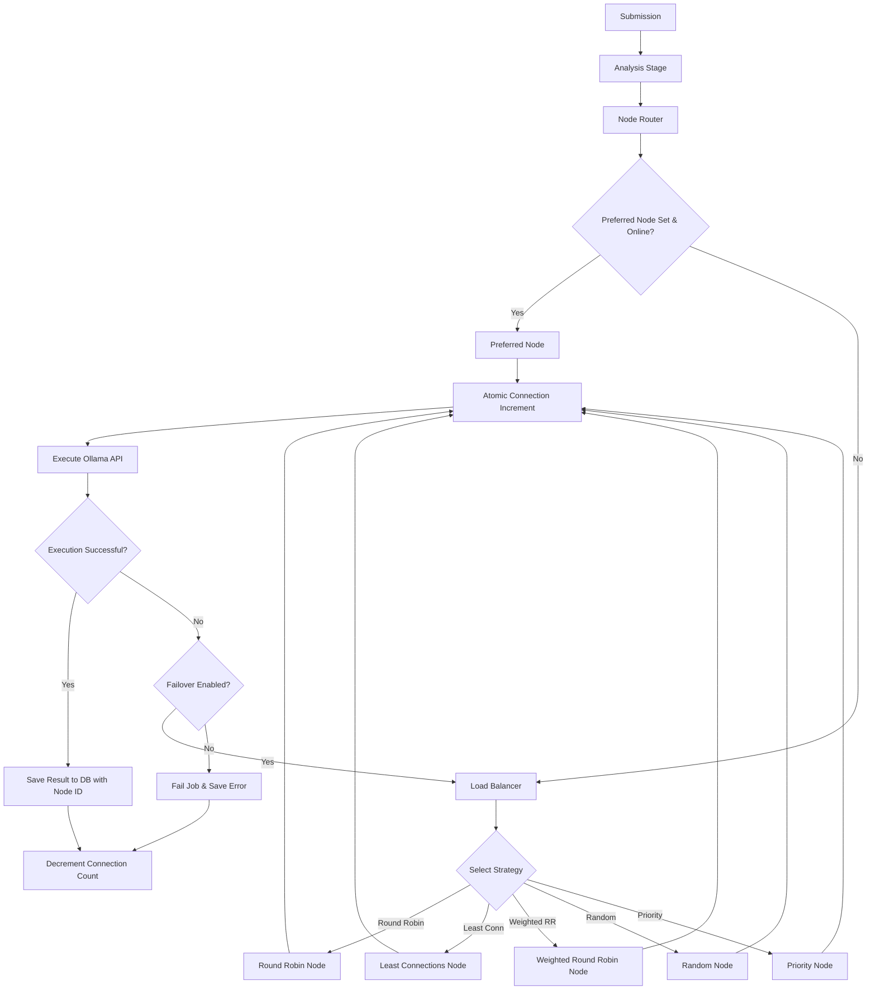

# AI Academic Reviewer

[](https://www.php.net/)
[](https://laravel.com/)
[](https://filamentphp.com/)
[](https://www.postgresql.org/)
[](https://redis.io/)
[](https://www.cloudflare.com/products/r2/)
[](LICENSE)

An enterprise-ready, production-quality **AI-Powered Academic Paper Evaluation and Peer Review System** built on the Laravel framework. The system automates the structural review, literature auditing, writing quality control, and grading of academic manuscripts and scientific articles, mimicking the rigorous peer-review process of international peer-reviewed journals.

---

## 🔬 Core Academic Review Pipeline & AI Cluster Routing

When an academic manuscript (PDF, DOCX, etc.) is uploaded, the background processing worker triggers a multi-stage analysis pipeline. Instead of binding to a static model or endpoint, the pipeline uses a dynamic, database-driven **AI Cluster & Load Balancing** routing system.

### Pipeline Execution Flow


### AI Cluster Routing & Load Balancing Flow


### Pipeline Analysis Stages
1. **Document Parsing & Text Extraction (`ExtractTextJob`)**: Parses Poppler-based PDF structures.
2. **Structural Summarization (`GenerateSummaryJob`)**: Dynamic summarization stage.
3. **Academic Writing & Grammar Check (`GenerateGrammarJob`)**: Readability and spell checks.
4. **Literature & Reference Audit (`GenerateReferencesJob`)**: Audit citations against references.
5. **Plagiarism & Similarity Analysis (`GenerateSimilarityJob`)**: Overlap analysis.
6. **Double-Blind Peer Review Scoring (`GenerateReviewerJob`)**: Scientific scoring and final decision.
7. **PDF Report Compilation (`GenerateReportJob`)**: Generates official PDF evaluation reports.

---

## Features

- **Multi-Stage Content Analysis Pipeline**: Built-in support for multiple analysis stages including text extraction, summarization, grammar validation, reference checks, similarity/plagiarism detection, readability scoring, and final reporting.
- **Polymorphic Media Management**: Integrated polymorphic media system supporting file uploads, automated checksum validation, mime-type classification, and optimization flag tracking.
- **Cloudflare R2 Integration**: S3-compatible cloud storage adapter configured out of the box for handling heavy media files globally.
- **Filament Administration Panel**: Full-featured, modern dashboard panel built with Filament PHP for managing users, submissions, analysis results, and configuration settings.
- **Docker-Ready Architecture**: Multi-container Docker environment setup providing isolated application, web server (Nginx), scheduler, and queue worker services.
- **Automated Background Processing**: Robust Redis-backed queue system for running asynchronous AI analysis pipelines.

---

## Tech Stack

- **Core Framework**: Laravel 13.x
- **Administration Panel**: Filament PHP 3.x / 5.x
- **Database**: PostgreSQL (main storage), SQLite (testing and local mock environments)
- **Caching & Sessions**: Redis (via `predis`)
- **Queue System**: Redis (`QUEUE_CONNECTION=redis`)
- **Storage Driver**: Cloudflare R2 / AWS S3 (via `league/flysystem-aws-s3-v3`)
- **Media Optimization Tools**: FFMPEG, Ghostscript, ImageMagick (integrated inside application containers)
- **Asset Bundler**: Vite 6.x
- **Code Style Tooling**: Laravel Pint

---

### Core Domain Models

1. **[User](app/Models/User.php)**: Represents application administrators and users. Integrates authentication services and owns submissions.
2. **[Submission](app/Models/Submission.php)**: The root entity for processing. Contains metadata, statuses (`pending`, `processing`, `completed`, `failed`, `cancelled`), and polymorphic media relations. Supports soft deletes.
3. **[Media](app/Models/Media.php)**: Polymorphic model linking physical files to submissions or analyses. Tracks size, mime type, original names, file extensions, SHA-256 checksums, storage disk, and optimization flags.
4. **[Analysis](app/Models/Analysis.php)**: Tracks analysis runs including configured providers (`ollama`, `openai`, `anthropic`, `google`), engines (`llm`, `embedding`, `ocr`, `speech`, `vision`), and specific models.
5. **[AnalysisResult](app/Models/AnalysisResult.php)**: Stores granular results per pipeline stage (`extract`, `summary`, `grammar`, `plagiarism`, etc.) alongside execution metrics (score, execution time, token count, financial cost, executing node, model, driver, and payload).
6. **[Node](app/Models/Node.php)**: Tracks AI cluster nodes, driver type (ollama, claude), endpoint URL, active connections count, priorities, weights, capabilities list, online status, and health-check history.
7. **[StageRoute](app/Models/StageRoute.php)**: Maps analysis pipeline stages directly to target models and preferred database nodes.
8. **[Report](app/Models/Report.php)**: Links final compiled reports (such as PDFs) to parent analyses.
9. **[Setting](app/Models/Setting.php)**: Handles key-value application configurations.

---

## Requirements

Ensure your environment meets the following requirements:

- **PHP**: `^8.3` (with `json`, `dom`, `curl`, `libxml`, `mbstring`, `gd`, `exif`, `pcntl`, `bcmath`, `zip`, and `redis` extensions)
- **Database**: PostgreSQL `15+` (or SQLite for development/testing)
- **Queue/Cache**: Redis Server `7.x+`
- **System Utilities (Required for media/PDF extraction)**: Poppler-utils (`pdftotext`), FFMPEG, Ghostscript, ImageMagick

---

## Installation

### Local Setup

Follow these steps to configure the project locally:

1. **Clone the Repository**
   ```bash
   git clone https://github.com/imcanugur/ai-analyzer/
   cd ai-analyzer
   ```

2. **Install Composer Dependencies**
   ```bash
   composer install
   ```

3. **Configure Environment**
   ```bash
   cp .env.example .env
   # Configure database, Redis, Cloudflare R2, and PDF/AI settings
   ```

4. **Generate Application Key**
   ```bash
   php artisan key:generate
   ```

5. **Run Database Migrations & Seeders**
   ```bash
   php artisan migrate
   ```

### Docker Deployment

The application includes a `docker-compose.yml` file which starts PHP-FPM, Nginx, a scheduler, and a queue worker:

1. **Configure Environment**
   Ensure `.env` matches your target docker setup.

2. **Build and Run Containers**
   ```bash
   docker compose up -d --build
   ```

The entrypoint container uses `install.sh` to automatically install vendor dependencies, run pending migrations, register assets, and optimize configurations.

---

## Environment Variables

### Custom Variables

| Variable | Description | Required | Default Value |
| :--- | :--- | :---: | :--- |
| `FILESYSTEM_DISK` | Default storage driver disk | No | `r2` |
| `PDF_BIN_PATH` | Path to the pdftotext executable | No | `/usr/bin/pdftotext` |
| `R2_ACCESS_KEY_ID` | Cloudflare R2 Access Key | If disk is `r2` | - |
| `R2_SECRET_ACCESS_KEY` | Cloudflare R2 Secret Key | If disk is `r2` | - |
| `R2_BUCKET` | Cloudflare R2 Bucket Name | If disk is `r2` | `storage` |
| `R2_REGION` | Cloudflare R2 Region | No | `auto` |
| `R2_ENDPOINT` | Cloudflare R2 API Endpoint | If disk is `r2` | `https://<accountid>.r2.cloudflarestorage.com` |
| `R2_CDN_URL` | Cloudflare CDN Public URL | No | - |
| `R2_PATH_STYLE` | Enforce path style URL layout | No | `true` |
| `RUN_MIGRATIONS` | Auto-run migrations in Docker container | No | - |
| `RUN_SEEDERS` | Auto-run database seeders in Docker container | No | - |
| `PORT` | Custom external port for Nginx service | No | `8080` |
| `AI_CLUSTER_ENABLED` | Enable AI routing cluster mode | No | `true` |
| `AI_CLUSTER_LOAD_BALANCER` | Routing strategy (round_robin, weighted_round_robin, least_connections, random, priority) | No | `round_robin` |
| `AI_CLUSTER_HEALTH_CHECK_INTERVAL` | Seconds between cron health probes | No | `30` |
| `AI_CLUSTER_RETRY` | Attempt count for executing AI requests | No | `3` |
| `AI_CLUSTER_TIMEOUT` | Seconds allowed per node connection execution | No | `300` |
| `AI_CLUSTER_FAILOVER` | Enable automated fallback to alternate online nodes | No | `true` |

---

## Queue and Background Workers

Asynchronous workflows are handled via Laravel Queues.

- **Queue Driver**: Redis
- **Manual Worker Execution**:
  ```bash
  php artisan queue:work --queue=default --sleep=3 --tries=3 --timeout=90
  ```
- **Docker Worker**: The `queue` service defined in `docker-compose.yml` continuously monitors background jobs automatically.

---

## Storage Architecture

Files are registered dynamically via the `Media` model. By default, the system uses Cloudflare R2 storage, but can fallback to local storage using the `FILESYSTEM_DISK` environment variable:

- **Local Storage**: Files are written to `storage/app/private/` and public assets to `storage/app/public/`. Use `php artisan storage:link` to expose public assets.
- **R2 Cloud Storage**: Large file uploads are dispatched directly using the AWS S3 driver configured for Cloudflare's storage API.

---

## Development & Utility Commands

Run these common commands during local development:

```bash
# Code Style Checks and Fixes (Laravel Pint)
composer exec pint

# Execute Feature and Unit Test Suites
php artisan test

# Run tests using SQLite database driver
DB_CONNECTION=sqlite DB_DATABASE=database/database.sqlite php artisan test

# Generate fresh migrations
php artisan migrate:fresh --seed
```

---

## Production Notes

When deploying to a production server:

1. **Optimize Cache**:
   ```bash
   php artisan config:cache
   php artisan route:cache
   php artisan view:cache
   php artisan event:cache
   ```
2. **Nginx Proxy Settings**: Adjust client body limits and timeouts within `nginx.conf` to accommodate large file uploads:
   ```nginx
   client_max_body_size 100M;
   fastcgi_read_timeout 600;
   ```
3. **Queue Monitoring**: Use a daemon manager like **Supervisor** to ensure the queue worker `php artisan queue:work` remains running.

---

## Contributing

Please ensure you adhere to the following when contributing code:
1. Maintain clean commit histories.
2. Run code style linting via Laravel Pint before submitting PRs.
3. Include unit and integration test coverage for any new features.

---

## License

This project is open-source software licensed under the [MIT License](LICENSE).

---

## Developer

Developed and maintained by **Can Uğur** — [@imcanugur](https://github.com/imcanugur).
